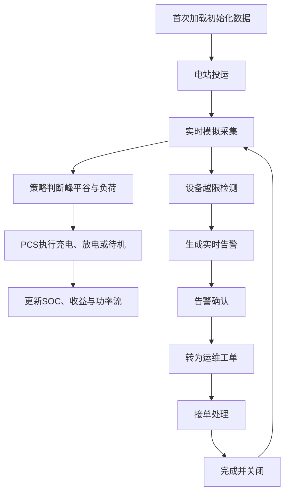

## 1. 产品概述
工商业储能EMS系统用于演示储能电站从投运、运营、运维、调度到监控的完整业务闭环，面向储能集成商、业主方、运维人员与售前演示场景。
- 系统以浏览器 LocalStorage 作为唯一数据存储，开箱即用，无需数据库或后端服务。
- 通过实时模拟引擎驱动功率、SOC、收益、告警、工单和电芯级数据，体现工程可信度与产品演示价值。

## 2. 核心功能

### 2.1 用户角色
| 角色 | 使用方式 | 核心权限 |
|------|----------|----------|
| 电站运营人员 | 本地浏览器访问 | 查看运营收益、充放电统计、调度执行状态 |
| 运维人员 | 本地浏览器访问 | 查看告警、确认告警、创建与流转工单 |
| 调度管理人员 | 本地浏览器访问 | 管理运行策略、下发策略、查看执行日志 |
| 系统管理员 | 本地浏览器访问 | 维护物模型、设备实例、点表、电站投运配置 |

### 2.2 功能模块
1. **首页**：一次系统图、关键KPI、功率流向、实时告警滚动、设备状态总览。
2. **投运管理**：物模型管理、设备实例化、点表配置、电站创建、电站投运、设备拓扑展示。
3. **运营管理**：运营总览、收益明细、充放电统计、电价管理、需量管理。
4. **运维管理**：实时告警、历史告警、告警规则配置、告警上报、工单管理、工单流转、运维报表。
5. **调度管理**：策略管理、策略类型、策略下发、策略调度计划、策略执行日志、实时调度指令。
6. **监控管理**：电站总览、PCS监控、BMS监控、电芯级监控、电表监控、环境监控、通讯状态监控。

### 2.3 页面详情
| 页面名称 | 模块名称 | 功能描述 |
|----------|----------|----------|
| 首页 | 一次系统图 | SVG展示电网、变压器、电表、PCS、BMS、电池簇、负荷与光伏之间的电气连接，状态着色并显示实时功率流向 |
| 首页 | KPI面板 | 展示今日收益、月收益、年收益、SOC、充放电量、CO₂减排、综合效率、告警数量 |
| 投运管理 | 物模型管理 | 展示PCS、BMS、电表、变压器物模型属性、遥测、遥信与控制命令 |
| 投运管理 | 设备与点表 | 支持查看设备实例、通讯参数、测点映射、寄存器地址、单位与缩放系数 |
| 投运管理 | 电站投运 | 一键投运，初始化电站、设备通讯与模拟采集状态 |
| 运营管理 | 运营总览 | 展示实时负荷、光伏、储能功率、并网点功率、收益构成和效率指标 |
| 运营管理 | 电价管理 | 展示峰、平、谷时段与电价，可调整分时电价配置 |
| 运维管理 | 实时告警 | 展示激活、已确认、已恢复告警，支持确认并转工单 |
| 运维管理 | 工单管理 | 支持告警转工单、接单、处理中、完成、关闭的状态闭环 |
| 调度管理 | 策略管理 | 管理削峰填谷、需量管理、调频、防逆流、离网备电策略，支持下发与暂停 |
| 调度管理 | 执行日志 | 展示策略下发、执行结果、PCS响应与异常信息 |
| 监控管理 | PCS监控 | 展示三相电压、电流、有功、无功、频率、温度、运行模式 |
| 监控管理 | BMS监控 | 展示SOC、SOH、SOP、总压、总流、单体极值、绝缘阻抗 |
| 监控管理 | 电芯级监控 | 以矩阵热力图展示20个以上电芯电压与温度，并定位极值电芯 |
| 监控管理 | 通讯监控 | 展示设备在线状态、延迟、丢包率与通讯链路状态 |

## 3. 核心流程
系统首次加载时初始化电站、设备、点表、电价、策略、告警、工单、电芯数据。用户进入首页查看电站运行状态，投运后模拟引擎每秒推进1分钟，根据电价与负荷执行充放电策略。若设备越限触发告警，运维人员确认告警并转工单，工单经过接单、处理、完成、关闭形成闭环。

## 4. 用户界面设计

### 4.1 设计风格
- 主色：深海工业蓝 `#081826`，强调色：储能绿 `#52c41a`、放电橙 `#faad14`、告警红 `#ff4d4f`、通讯紫 `#722ed1`。
- 视觉方向：工业控制中心风格，深色背景、玻璃拟态面板、发光功率流线、精密仪表与数据密度并重。
- 按钮样式：小圆角、弱描边、状态色填充，关键操作按钮具备明确反馈。
- 字体：中文界面采用清晰现代的无衬线字体栈，数字指标使用等宽数字风格以增强工业读数感。
- 布局：桌面优先，顶部导航、左侧五大模块菜单、主内容面板、底部状态栏。
- 图标风格：线性工业图标、设备状态点、SVG电气符号，不使用无业务含义装饰。

### 4.2 页面设计概览
| 页面名称 | 模块名称 | UI元素 |
|----------|----------|--------|
| 首页 | 一次系统图 | SVG设备节点、动态虚线流向、状态色边框、设备铭牌弹窗 |
| 首页 | KPI卡片 | 大号数值、单位标签、环比标识、微型趋势线 |
| 运营管理 | 收益与功率 | 折线图、柱状图、功率流卡片、分时电价色带 |
| 运维管理 | 告警与工单 | 等级标签、状态标签、筛选条、操作按钮、弹窗表单 |
| 调度管理 | 策略列表 | 策略状态、优先级、版本、下发按钮、执行日志抽屉 |
| 监控管理 | 电芯矩阵 | 电压/温度热力色块、极值高亮、统计摘要 |

### 4.3 响应式设计
桌面优先，适配1366px以上工业大屏与常规PC屏幕；窄屏下左侧菜单折叠，数据表格横向滚动，KPI卡片自动换行。核心监控图与电芯矩阵保持可读性优先。
