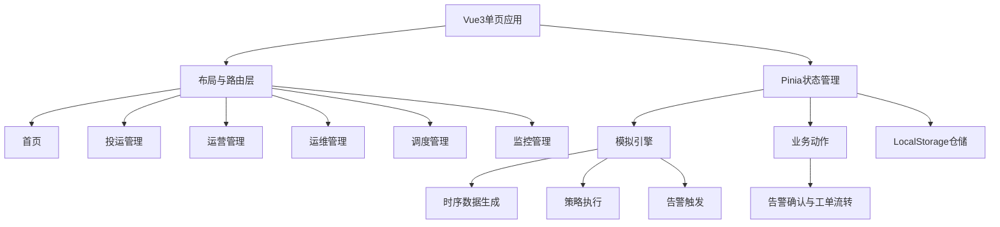
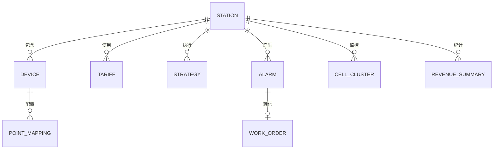

## 1. 架构设计
系统采用纯前端单页应用架构，所有业务数据存储在浏览器 LocalStorage。前端应用包含页面层、组件层、模拟引擎层、数据仓储层与本地持久化层，不连接数据库或后端服务。



## 2. 技术说明
- 前端：Vue3 + TypeScript + Vite
- 状态管理：Pinia
- 路由：Vue Router
- 图表：ECharts
- 样式：原生 CSS 变量 + 组件级样式
- 数据存储：LocalStorage
- 数据刷新：`setInterval` 每秒推进1分钟模拟时间
- 后端：无
- 数据库：无

## 3. 路由定义
| 路由 | 用途 |
|------|------|
| `/` | 首页，展示一次系统图、KPI、功率流、实时告警 |
| `/commissioning` | 投运管理，展示物模型、设备实例、点表、电站投运 |
| `/operation` | 运营管理，展示收益、充放电、电价、需量管理 |
| `/maintenance` | 运维管理，展示实时告警、历史告警、规则、工单与报表 |
| `/dispatch` | 调度管理，展示策略管理、下发、计划、日志与实时指令 |
| `/monitoring` | 监控管理，展示PCS、BMS、电芯、电表、环境与通讯状态 |

## 4. API定义
本项目无后端API。页面通过 Pinia Store 调用本地仓储方法读写 LocalStorage。

```typescript
export interface LocalRepository<T> {
  load(key: string): T | null
  save(key: string, value: T): void
}
```

## 5. 数据模型

### 5.1 数据模型定义


### 5.2 TypeScript数据结构
```typescript
export type DeviceType = 'PCS' | 'BMS' | 'METER' | 'TRANSFORMER'
export type DeviceStatus = '运行（充电）' | '运行（放电）' | '待机' | '故障' | '通讯中断'

export interface Station {
  id: string
  name: string
  location: string
  capacity: string
  commissionDate: string
  status: string
  devices: Device[]
}

export interface Device {
  id: string
  name: string
  type: DeviceType
  modelId: string
  status: DeviceStatus
  communication: {
    protocol: 'Modbus TCP' | 'Modbus RTU' | 'IEC104'
    ip?: string
    port?: number
    interval: string
  }
}

export interface RealtimeSnapshot {
  timestamp: string
  loadPower: number
  pvPower: number
  storagePower: number
  gridPower: number
  soc: number
  pcsTemperature: number
  mode: '充电' | '放电' | '待机' | '离网'
}

export interface Alarm {
  id: string
  stationId: string
  deviceId: string
  deviceName: string
  name: string
  level: '提示' | '一般' | '严重' | '紧急'
  description: string
  status: '激活' | '已确认' | '已恢复'
  occurredAt: string
  confirmedAt?: string
  recoveredAt?: string
}

export interface WorkOrder {
  id: string
  stationId: string
  title: string
  source: '告警' | '人工'
  alarmId?: string
  priority: '低' | '中' | '高' | '紧急'
  status: '待接单' | '处理中' | '已完成' | '已关闭'
  assignee: string
  createdAt: string
  acceptedAt?: string
  completedAt?: string
  solution?: string
}
```

## 6. 数据模拟规则
- 时间格式统一为 `YYYY-MM-DD HH:mm:ss`。
- 每秒推进1分钟，读取24小时基表并叠加3%到5%的合理波动。
- 夜间光伏出力为0，负荷不小于0。
- SOC限制在10%到95%之间，展示格式保留2位小数并带 `%`。
- 峰时段且负荷高、SOC充足时放电；谷时段且SOC低于90%时充电；平时段待机或维持SOC。
- PCS温度、电芯电压差、通讯异常等条件触发告警，告警可转工单。
- 金额保留2位小数并带 `元`，功率保留1位并带 `kW`，电量保留2位并带 `kWh`。

## 7. 关键实现约束
- 禁止连接任何数据库或后端服务。
- 禁止出现“测试”、“demo”、“xxx”、“test”等占位符标签或数据。
- 首次加载必须自动初始化至少一个电站、四类设备、点表、24小时时序、电价、策略、告警、工单与电芯数据。
- 核心页面至少实现：首页、运营总览、实时告警、策略管理、电芯监控。
- 至少实现投运、运营、告警、工单、完成的完整业务闭环。
